# 🎙️ Voice AI Backend

> **A production-grade backend for a Voice -> STT -> LLM -> TTS pipeline with conversational AI, memory, and skills.**


---

## 📖 Overview

This project implements a robust backend for a Voice AI assistant. It handles real-time audio streaming, speech-to-text transcription, intelligent LLM processing with context-aware memory, and text-to-speech synthesis. It is designed to be modular, scalable, and easily extensible with new skills and LLM providers.

## 🏗️ Architecture

The system is built on a microservices-like architecture within a modular monolith.

```mermaid
graph TD
    subgraph "Frontend"
        FlutterApp[📱 Flutter Mobile App]
    end

    subgraph "Backend (FastAPI)"
        API[🔌 API Gateway / WebSocket]
        Auth[🛡️ Auth Service]
        Orchestrator[🧠 LLM Orchestrator]
        Skills[🛠️ Skill Registry]
        MemoryMgr[💾 Memory Manager]
    end

    subgraph "Data Layer"
        Postgres[(🐘 PostgreSQL\nUser Profiles & Logs)]
        Redis[(⚡ Redis\nShort-term Memory & Cache)]
        VectorDB[(🔍 Vector DB\nLong-term Memory)]
    end

    subgraph "External Services"
        LLM_API[🤖 LLM Providers\n(OpenAI, Gemini, Local)]
        STT_API[🗣️ STT Service]
        TTS_API[🔈 TTS Service]
    end

    FlutterApp <-->|WebSocket / HTTP| API
    API --> Auth
    API --> Orchestrator
    Orchestrator --> MemoryMgr
    Orchestrator --> Skills
    Orchestrator <--> LLM_API
    Orchestrator <--> STT_API
    Orchestrator <--> TTS_API
    MemoryMgr <--> Postgres
    MemoryMgr <--> Redis
    MemoryMgr <--> VectorDB
```

### Key Components
- **FastAPI**: High-performance Async I/O for REST and WebSockets.
- **WebSockets**: Real-time bi-directional audio streaming.
- **Modular LLM Engine**: Supports OpenAI, Gemini, and Local LLaMA.
- **Memory System**:
    - **Short-term**: Redis (Conversation context).
    - **Long-term**: Vector DB (Semantic search).
    - **Profile**: Postgres (User preferences).
- **Skill System**: Extensible registry for actions (Calling, SMS, Navigation).

---

## 🔄 Process Flow

The following diagram illustrates the lifecycle of a voice interaction:

```mermaid
sequenceDiagram
    participant User
    participant App as 📱 Flutter App
    participant WS as 🔌 WebSocket Endpoint
    participant Orch as 🧠 Orchestrator
    participant LLM as 🤖 LLM Provider
    participant Mem as 💾 Memory
    participant TTS as 🔈 TTS Engine

    User->>App: Speaks 🗣️
    App->>WS: Streams Audio Chunks 🌊
    WS->>Orch: Transcribes Audio (STT)
    Orch->>Mem: Retrieve Context 🔍
    Mem-->>Orch: Context Data
    Orch->>LLM: Send Prompt + Context
    LLM-->>Orch: Generated Response 📝
    
    alt Skill Triggered
        Orch->>Orch: Execute Skill 🛠️
    end

    Orch->>TTS: Synthesize Response
    TTS-->>WS: Audio Stream 🎵
    WS-->>App: Play Audio
    App->>User: Hears Response 👂
```



---

## 📱 Wireframes & UI Flow

The mobile application follows a clean, intuitive flow designed for voice-first interaction.

```mermaid
graph LR
    Splash[🚀 Splash Screen] --> Auth[🔐 Login / Register]
    Auth --> Home[🏠 Home Dashboard]
    
    subgraph "Main Interface"
        Home --> VoiceMode[🎙️ Voice Chat Mode\n(Main Interaction)]
        Home --> History[📜 Chat History]
        Home --> Settings[⚙️ Settings\n(Voice, Persona, API Keys)]
    end

    VoiceMode -->|Active Call| ActiveState[🔴 Listening / Speaking]
    ActiveState -->|End| Home
```

---

## 🚀 Getting Started

### Prerequisites
- **Python 3.10+**
- **PostgreSQL**
- **Redis**
- **Milvus** (or other Vector DB)

### Installation

1. **Clone the repository**
   ```bash
   git clone <repo-url>
   cd backend
   ```

2. **Create a virtual environment**
   ```bash
   python -m venv venv
   source venv/bin/activate  # Windows: venv\Scripts\activate
   ```

3. **Install dependencies**
   ```bash
   pip install -r requirements.txt
   ```

4. **Environment Setup**
   Copy `.env.example` to `.env` and update the values.
   ```bash
   cp .env.example .env
   ```

### Database Setup

1. **Create the PostgreSQL database**
   ```sql
   CREATE DATABASE voice_ai;
   ```

2. **Run Migrations**
   Ensure your database is running and configured in `.env`.

### Running the Application

Start the server with hot-reload:
```bash
uvicorn backend.main:app --reload
```

- **API**: `http://localhost:8000`
- **Docs**: `http://localhost:8000/docs`

---

## 🔌 API Endpoints

| Method | Endpoint | Description |
| :--- | :--- | :--- |
| **POST** | `/api/v1/auth/register` | Register a new user |
| **POST** | `/api/v1/auth/token` | Login and get access token |
| **POST** | `/api/v1/chat/message` | Send a text message |
| **WS** | `/api/v1/ws/stream` | Real-time voice stream |
| **GET** | `/api/v1/skills/` | List available skills |
| **POST** | `/api/v1/memory/search` | Semantic search in memory |

---

## 📂 Project Structure

```
backend/
├── api/            # REST routes and WebSocket handlers
├── llm/            # Orchestrator, Prompt Builder, Providers
├── memory/         # Redis, Vector DB, Postgres controllers
├── skills/         # Action registry and implementations
├── db/             # Database models and session
└── core/           # Config and security
```

---

Made with ❤️ by the Voice AI Team
